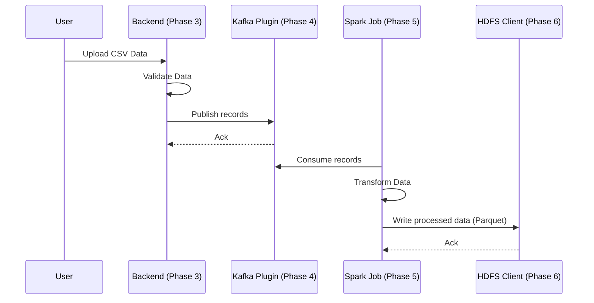

# Data Flow

This sequence covers the primary path of a data record through the system. Refer to the respective phase code (e.g., CsvSourcePlugin, Spark jobs, WebHDFS client) for implementation details.
