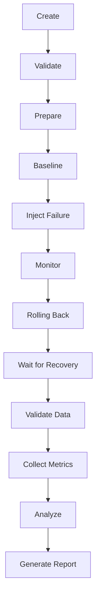

# Reliability Flow

This details the ChaosLab Phase 7 experiment lifecycle.

## Lifecycle Stages

1. **Create**: User defines the experiment (target, fault, duration).
2. **Validate**: System checks safety constraints (allow-list, labels).
3. **Prepare**: System prepares dependencies.
4. **Baseline**: Measures pre-fault metrics.
5. **Inject Failure**: Applies the fault (e.g. stop container, restart, network delay).
6. **Monitor**: Collects data during fault.
7. **Rolling Back**: Restores normal state.
8. **Wait for Recovery**: Verifies target is healthy again.
9. **Validate Data**: Checks for data loss/corruption.
10. **Collect Metrics**: Pulls post-fault metrics.
11. **Analyze**: Computes recovery time, impact.
12. **Generate Report**: Stores final report in DB.

**Limitations**: Process-kill is not fully implemented on Alpine containers lacking specific utilities, so container-level faults (stop/restart/pause) are preferred.
